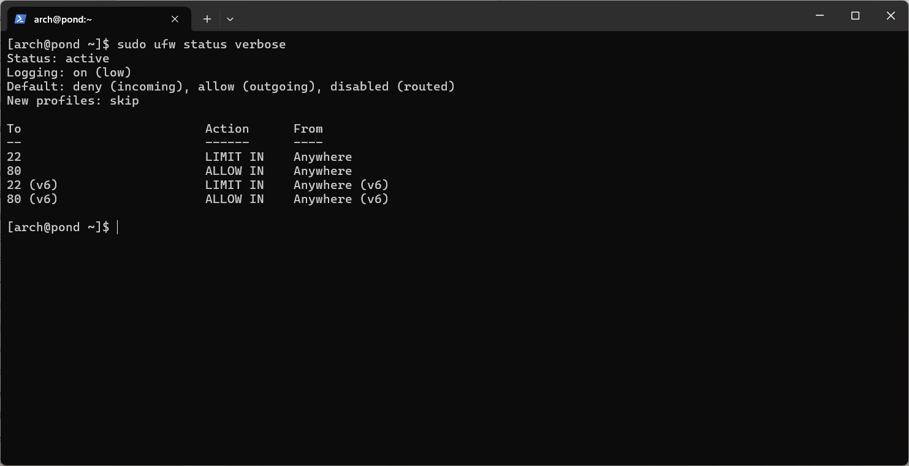
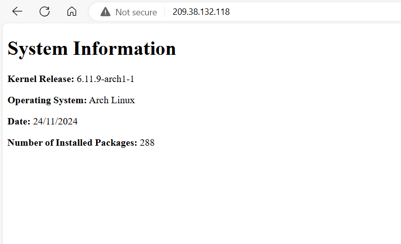

Name : Noppanat Sripan
Student ID : A01373963


This tutorial explains how to set up a Bash script that generates a static index.html file with system information daily at 05:00. It uses a systemd service and timer on an Arch Linux droplet with an Nginx web server and UFW for firewall protection.

## Features
- Automates daily generation of a static `index.html` with system information.
- Uses `systemd` service and timer for scheduling.
- Display the HTML file through an Nginx web server.
- Use UFW to secure the server.

## Files
- `generate-index.service` : control the script/process `generate_index`
- `generate-index.timer` : control the time to update the script
- `generate_index` : generate html file (contain your system info)
- `nginx.conf` :  config file for package nginx
- `webgenServer.conf` : config for webserver

## Requirement 
- Packages:
   1. `git` to clone the repository.
   2. `nginx` to host a web server.
   3. `ufw` to control the firewall.

- All files in the repository (use git clone).
- Arch Linux.
- Sudo privileges.


## How to Use
Assuming you are in the repository folder, 
**Follow the steps**: 
1. Create User.
2. Configure `systemd`.
3. Set up `nginx`.
4. Set up `ufw`.


### 1. Create User
this step is to create a System user `webgen` and the home directory (including the sub-folder) to make `webgen` handle any tasks that is related to generate a static file 

Home directory structure
```text
/var/lib/webgen
|
|_____/bin
|       └-generate_index
|_____/HTML
        └-index
```
- `bin` folder is going to be the place where we put the script ``generate_index`` and execute it from `.service` file (systemd)
- `HTML` is folder a that store HTML file that is created by `generate_index`


1. create system user `webgen`
```bash
useradd -r -d /var/lib/webgen -m webgen -s /usr/bin/nologin
```

2. create `bin`  and `HTML` folder inside `webgen`  home directory
```bash
sudo mkdir /var/lib/webgen/bin 
sudo mkdir /var/lib/webgen/HTML
```

> [!note]
> since we can't switch to user `webgen`, we need to use `sudo` to create the folder inside `webgen` home directory

4. move file `generate_index` from repository to `bin`
```bash 
mv generate_index /var/lib/webgen/bin
```

5. give permission to execute the script
```bash
chmod +x /var/lib/webgen/bin/generate_index
```

since `webgen` user will be the person who controls the script and service, we need to change the ownership of the files in the home directory 

6. change the permission of the folder (and include anything inside) to `webgen`
```bash
sudo chown -R webgen:webgen /var/lib/webgen
```


>[!note]
 the reason to create a system user and not regular user is to isolate task and permission, reducing the risks of accidental errors and malicious changes

>[!Tip]
>By separate user and give the permission to do the user only what they need, it follows the principle of principle of least privilege (POLP): Grant only the minimum permissions necessary for a user, process, or application to perform its tasks, and nothing more

https://www.techtarget.com/searchsecurity/definition/principle-of-least-privilege-POLP


### 2. Config `systemd`
in this step we will use the `generate-index.service` and `generate-index.timer`  from the repository to set up `systemd` to run the `generate_index` every day at 5 am.

as the `generate-index.service,generate-index.timer ` files are provided in the repository, you should be able to do the following steps.

the `generate-index.service` has the following content inside
```bash
[Unit]
Description=HTML-Gen  # Description of the service
Wants=network-online.target # optional dependency
After=network-online.target # set it to run after network-online.target

[Service]
Type=oneshort # run it one time when it was call
User=webgen # user who run
Group=webgen # group who run
ExecStart=/var/lib/webgen/bin/generate_index # the script that it run


[Install]
WantedBy=multi-user.target 

```

the `generate-index.timer` has the following content inside 
```bash
[Unit]
Description=Gen_index_every5am # description 

[Timer]
OnCalendar=*-*-* 05:00:00 # set the time to run every day 5 am

Persistent=true # if server down on 5am, allow it to run as soon as the server start

[Install]
WantedBy=timers.target #ensure timer start automatically

```


1. move `generate-index.service` to `/etc/systemd/system`
```bash
sudo mv generate-index.service /etc/systemd/system
```

2. start the service 
```bash
sudo systemctl start generate-index
```

3. enable the service (run when the server is start)
```bash
sudo system enable generate-index
```

now that we are done setting up the `generate-index.service` file, this should create `index.html` in the folder `HTML`

next, we are going to configure the `generate-index.timer` file.

4. move `generate-index.service` to `/etc/systemd/system`
```bash
sudo mv generate-index.service /etc/systemd/system
```

5. start the timer 
```bash
sudo systemctl start generate-index.timer
```

6. enable the service (run when the server is start)
```bash
sudo systemctl enable generate-index
```

7. finally, to check if the `.timer` is running
```bash
sudo systemctl list timer
```
this will show the list of timers that are currently running on your system


> [!Tip]
> if the error shows on the status, use `journal -ex -u <service>` to check the log of service or timer file or use `sudo systemctl status <process/timer_name>.timer`

### 3. Set up Nginx
in this step, you will set up the nginx using the file `nginx.conf` in this repository (make sure `nginx` is downloaded)

the `nginx.conf` have the following content 
(the following setting are from https://wiki.archlinux.org/title/Nginx)
```text
user webgen;
worker_processes auto;
worker_cpu_affinity auto;

events {
    multi_accept on;
    worker_connections 1024;
}

http {
    charset utf-8;
    sendfile on;
    tcp_nopush on;
    tcp_nodelay on;
    server_tokens off;
    log_not_found off;
    types_hash_max_size 4096;
    client_max_body_size 16M;

    # MIME
    include mime.types;
    default_type application/octet-stream;

    # logging
    access_log /var/log/nginx/access.log;
    error_log /var/log/nginx/error.log warn;

    # load configs
    include /etc/nginx/conf.d/*.conf;
    include /etc/nginx/sites-enabled/*;
}
```

1. make `nginx` back-up file
```bash
sudo cp /etc/nginx/nginx.conf /etc/nginx/nginx_backup.conf
```

>[!note]
>the reason that we are making nginx backup is to avoid any errors created with the new nginx.conf and be able to go back to the default settings if needed

2. move the `nginx.conf` from the repository to `/etc/nginx/`
```bash
sudo mv nginx.conf /etc/nginx/
```

3. make folder contain server configuration
```bash
sudo mkdir /etc/nginx/sites-available
sudo mkdir /etc/nginx/sites-enabled
```
- `sites-available` folder is for storing _all_ of your vhost configurations, whether or not they're currently enabled.
- `sites-enabled` folder contains symlinks to files in the sites-available folder. This allows you to selectively disable vhosts by removing the symlink.

4. move the `webgenServer.conf` sites-available 
```bash
sudo mv webgenServer.conf /etc/nginx/sites-available
```

5. create symbolic link from `webgenServer.conf` in sites-enable pointing to sites-available
```bash
sudo ln -s /etc/nginx/sites-available/webgenServer.conf /etc/nginx/sites-enabled/webgenServer.conf
```

6.  start the `nginx` and make it start when server boost
```bash
sudo systemctl start nginx
sudo systemctl enable nginx
```

After you done everything, this will create a website from your droplet (arch linux) ip address showing information of your system (port 80)

**Why separate server block file?**
Using separate server block files for virtual hosts is important because each website has its own file. This allows for easy enabling or disabling by moving files in and out of `sites-enabled`. It also simplifies configuration management by keeping files organized and easier to maintain.


https://serverfault.com/questions/527630/difference-in-sites-available-vs-sites-enabled-vs-conf-d-directories-nginx

https://wiki.archlinux.org/title/Nginx

>[!note]
>`sudo nginx -t` to check the syntax and test the file
> `sudo systemctl status nginx` to check the status of the process
> `journal -ex -u nginx` to see the log file of the process

### 4. Set up `ufw`
in this step, we will config the `ufw` firewall to:
- allow ssh and http from anywhere (22)
- enable ssh rate limiting
- allow http connections

this configuration enables http connection, allowing other people to access your website. It also allows SSH access for you to be able to connect to your droplet (this also allows other people to connect, since we didn't limit it to your IP address). Additionally, we want to limit the failed login attempts to prevent other people to brute-force attack the droplet. 

1. enable and start the service
```bash
sudo systemctl enable --now ufw.service
```
2. set the table rule to allow ssh from anywhere
```bash
sudo ufw allow SSH
```
3. limit the incoming ssh
```bash
sudo ufw limit ssh
```
4. allow http
```bash
sudo ufw allow http
```
5. check that ssh is set in the table rules
```bash
sudo ufw app list
```
6. after make sure that ssh is in the app list, turn on firewall
```bash
sudo ufw enable
```

**To check the status of the firewall**
```bash
sudo ufw status verbose
```
this should show the following configuration:



explanation 
- **allow** (ipv4 and ipv6) port 22 (SSH) but **limit** the ssh times, any IP address can ssh
- **allow** (ipv4 and ipv6)port 80 (http) from any ip 


## DONE
you are done setting up everything, you can now try to access the website from your droplet IP address. This should show your information about your system. 
example: http://209.38.132.118/



## 